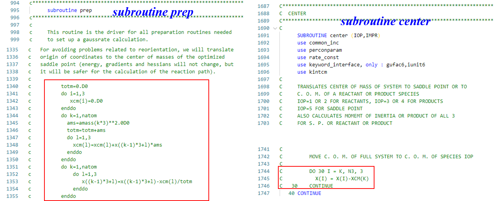

# QT_Polyrate17_Gaussrate17_Mod
Modification of Quantum tunneling computational code (Polyrate 17 &amp; Gaussrate 17)

## Purpose
For avoiding problems related to reorientation, The original Polyrate and Gaussrate code will translate origin of coordinates to the center of masses of the optimized saddle point. However, when computations under external electric fields were tried, energies were changed after translation in external electric fields. Therefore, we comments the translation part in the code, and recompile it. It works well in our computation.

## Code Modification

## Usage
copy the hooks_gr.F file to the Polyrate17/gaussrate17-B/source/

copy the polyag.F file to the Polyrate17/src/

recompiler the Polyrate and Gaussrate code.

## Original code
Visite the home page for downloading the original code:  
https://comp.chem.umn.edu/polyrate/ 
  
https://comp.chem.umn.edu/gaussrate/

## Citations
**Polyrate 17**:  
Zheng, J. B., J. L.; Meana-Pañeda, R.; Zhang, S.; Lynch, B. J.; Corchado, J. C.; Chuang, Y.-Y.; Fast, P. L.; Hu, W.-P.; Liu, Y.-P.; Lynch, G. C.; Nguyen, K. A.; Jackels, C. F.; Fernandez Ramos, A.;Ellingson, B. A.; Melissas, V. S.; Villà, J. Rossi, I.; Coitiño, E. L.; Pu, J.; Albu, T. V.; Ratkiewicz, A.; Steckler, R.; Garrett, B. C.; Isaacson, A. D.; Truhlar, D. G. Polyrate-version 2017-C, University of Minnesota: Minneapolis, **2017**.

**Gaussrate 17**:  
Jingjing Zheng, J. L. B., Shuxia Zhang, José C. Corchado, Rubén Meana-Pañeda, Yao-Yuan Chuang, Elena L. Coitiño, Benjamin A. Ellingson, and Donald G. Truhlar Gaussrate 17-B, University of Minnesota, Minneapolis, MN 55455-0431, USA, **2017**.

Modification for external electric fields cases: 

coming soon
..

